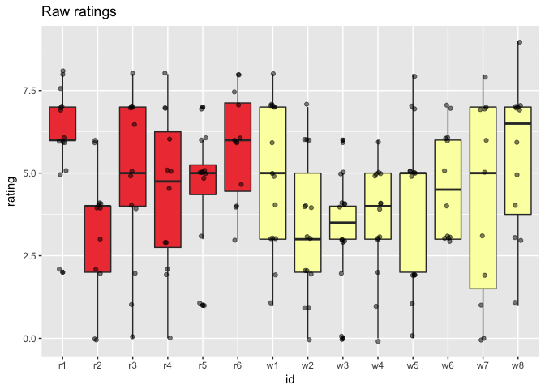
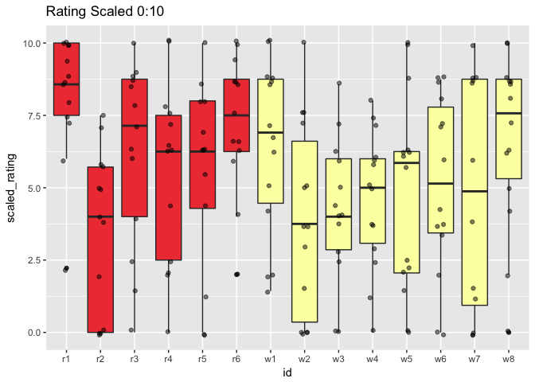
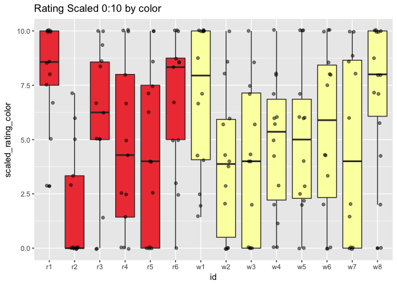
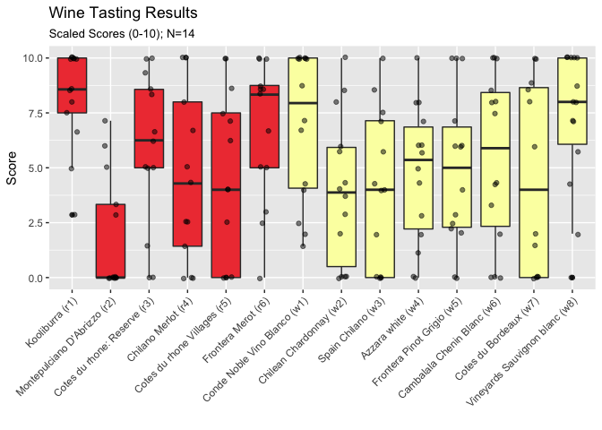
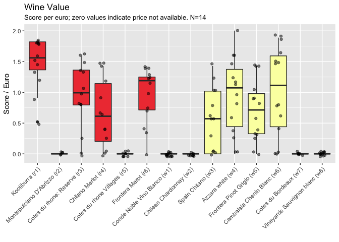
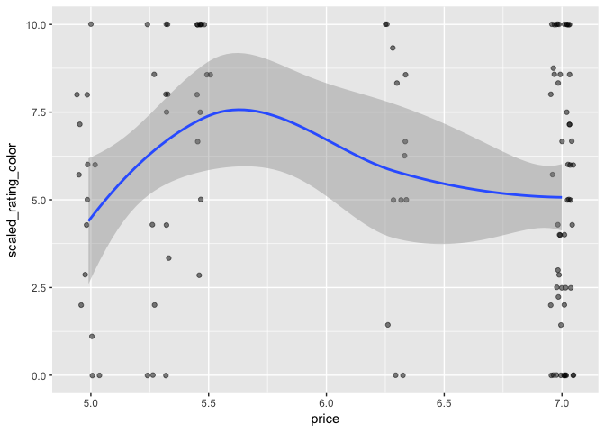
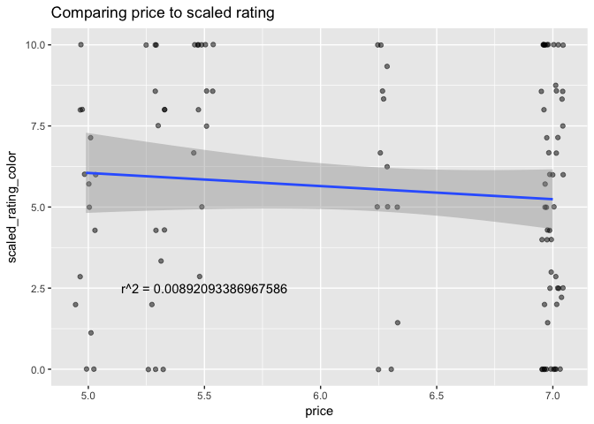
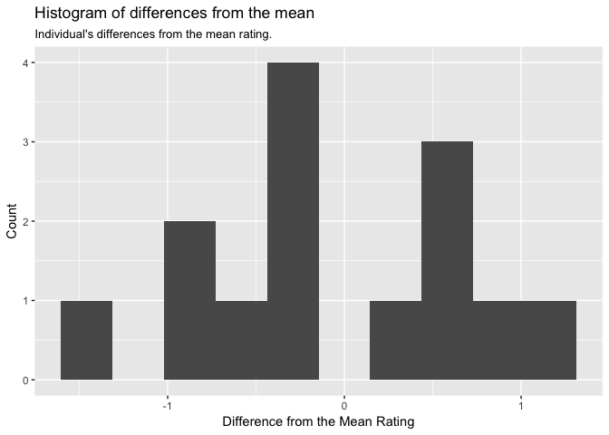
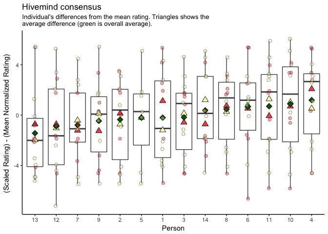

## The premise
Each year for the NUIG Postgrad Ball, we need to provide wine.  We are but poor students, and have no sommelier for the department.  So, we set out to find the best wine in Galway in February 2018.  The best wine for under 7 euro, that is. 

## The Study
We recruited 15 volunteers, including yours truly.  As such, this is a single-blind study.  We covered the label of the wines with blank paper, removed corks to prevent the cork-vs-screw cap bias, and labeled the bottles W[1-8] or R[1-6], as needed.  Samples were poured mostly in order of the bottle number, but some variation was introduced due to the number of people, number of bottles, and overeager tasters.  A vase for excess wine was provided to prevent the pressure to finish ones glass.  Approximately 10-20 ml were provided in either a wine or champagne glass (due to availability).  Participants were instructed to not characteristics of the wine and rate  on a scale from 1 to ten.

## the data
Lets read in the data.

```r
data <- read.csv(file = "data/responses.csv")
str(data)
```

```
## 'data.frame':	210 obs. of  4 variables:
##  $ person: int  1 1 1 1 1 1 1 1 2 2 ...
##  $ id    : Factor w/ 14 levels "r1","r2","r3",..: 7 8 9 10 11 12 13 14 7 8 ...
##  $ rating: num  6 0 0 1 2 3 8 9 8 6 ...
##  $ notes : Factor w/ 102 levels ""," bitter, brown tasting",..: 1 1 1 1 1 1 1 1 3 85 ...
```

```r
#lets add a colum for color
data$color <- as.factor(ifelse(grepl("r", data$id), "red", "white"))
data <- data
summary(data)
```

```
##      person         id          rating                        notes    
##  Min.   : 1   r1     : 15   Min.   :0.00                         :105  
##  1st Qu.: 4   r2     : 15   1st Qu.:3.00   no                    :  2  
##  Median : 8   r3     : 15   Median :5.00   not bad               :  2  
##  Mean   : 8   r4     : 15   Mean   :4.45   ok                    :  2  
##  3rd Qu.:12   r5     : 15   3rd Qu.:6.00   please no             :  2  
##  Max.   :15   r6     : 15   Max.   :9.00    bitter, brown tasting:  1  
##               (Other):120   NA's   :29     (Other)               : 96  
##    color    
##  red  : 90  
##  white:120  
##             
##             
##             
##             
## 
```

And lets plot those values.

```r
ggplot(data, aes(x=id, y=rating, fill=color)) + 
  geom_boxplot() + 
  labs(title="Raw ratings")+
  scale_fill_manual(values = colors, guide=F) + 
  geom_jitter(alpha=.5, height = .1, width = .1) 
```

```
## Warning: Removed 29 rows containing non-finite values (stat_boxplot).
```

```
## Warning: Removed 29 rows containing missing values (geom_point).
```

<!-- -->

So, we have some issues right away.  You notice that some people answered in mixed numbers, and there is a good bit of missing data. Some of that looks like complete sets (a person who did not score any reds or any whites), and sometimes it looks like they just didn't give a number for the ones they didn't like.  Because we have the tasting notes, lets go through and replace the missing values with 1's for the wines with missing values but having a negative commented (ie, "nope", "gross", etc).  While we're at it, lets give missing values of something neutral, 5, for those with neutral comments ("nice", "yes", etc).

```r
table(is.na(data$rating))
```

```
## 
## FALSE  TRUE 
##   181    29
```

```r
data$rating <- ifelse(is.na(data$rating) & grepl("no|nah|not.*good", data$notes), 0, data$rating)
data$rating <- ifelse(is.na(data$rating) & grepl(".+", data$notes), 5, data$rating)
table(is.na(data$rating))
```

```
## 
## FALSE  TRUE 
##   190    20
```

That got rid of 9 NA's with sensible values, so I am happy about that.  Now, lets take a look at our responses by person; we dot want someone who is giving out all 10s, etc.  Are there any strange people that we should be aware of?


```r
ggplot(data, aes(x=color, y=rating, fill=color)) +
  scale_fill_manual(values = colors, guide=F) + 
  labs(title="Color preference by person")+
  geom_boxplot() + facet_wrap(~person) +
  geom_jitter(alpha=.5, height = .05, width = .15) 
```

```
## Warning: Removed 20 rows containing non-finite values (stat_boxplot).
```

```
## Warning: Removed 20 rows containing missing values (geom_point).
```

<!-- -->

We have a few interesting things here.  Some people (3,4,12) seem to have a clear preference for red over white; others (2,10, maybe 9) prefer whites.

It looks like #5 didn't rate any of the red wines. But, they have a decent spread for the whites, so there should be no harm in including them.

On the other hand, person #15 doesn't seem to have reported anything for the whites, but also had few responses.


```r
print(data[data$person == 15,])
```

```
##     person id rating                        notes color
## 113     15 w1      3                    please no white
## 114     15 w2      4                   please noe white
## 115     15 w3      3 like gone off jam with socks white
## 116     15 w4     NA                              white
## 117     15 w5     NA                              white
## 118     15 w6     NA                              white
## 119     15 w7     NA                              white
## 120     15 w8     NA                              white
## 205     15 r1     NA                                red
## 206     15 r2     NA                                red
## 207     15 r3     NA                                red
## 208     15 r4     NA                                red
## 209     15 r5     NA                                red
## 210     15 r6     NA                                red
```

While they have funny comments, ignoring all but three of the wines is hardly helpful.  Do they love the ones they didn't rate? did they hate them and give up? Who knows.  Further, their ratings only range from3 to 4.  hardly helpful.  Lets remove them from the analysis.


```r
data <- data[data$person != 15, ]
```

On closer inspection, you'll find there are 15 participants for the white wine, and 14 for the red. Further, the range should go from 1 to ten, but it instead goes from zero to 9.  Luckily, we tried (no promises) to ensure that person 1 was the same for both the reds and the whites. Lets try to normalize a scale from 0:10 based on their mean and max ratings.


```r
data <- data %>% 
  group_by(person) %>%
  mutate(scaled_rating = (rating - min(rating, na.rm = T))/(max(rating, na.rm = T) - min(rating, na.rm=T)) * 10) %>%
  as.data.frame()

ggplot(data, aes(x=id, y=scaled_rating, fill=color)) +   
  scale_fill_manual(values = colors, guide=F) + 
  labs(title="Rating Scaled 0:10")+
  geom_boxplot() + 
  geom_jitter(alpha=.5, height = .1, width = .1) 
```

```
## Warning: Removed 9 rows containing non-finite values (stat_boxplot).
```

```
## Warning: Removed 9 rows containing missing values (geom_point).
```

<!-- -->

That's interesting; the values do shift around a bit.  The variances are wider, so the responses are starting to look a bit more similar.

We should note that we did the white wine tasting first, and then proceeded on to the reds.  That, combined with the fact that most people (myself included) prefer either red or white, makes me think that we should separate both by person and by color of the wine.  Its not really fair to compare a (gross) dessert white to a (tasty) Shiraz, after all...


```r
data <- data %>% 
  group_by(person, color) %>%
  mutate(scaled_rating_color = (rating - min(rating, na.rm = T))/(max(rating, na.rm = T) - min(rating, na.rm = T)) * 10) %>%
  as.data.frame()
```

```
## Warning in min(rating, na.rm = T): no non-missing arguments to min;
## returning Inf
```

```
## Warning in max(rating, na.rm = T): no non-missing arguments to max;
## returning -Inf
```

```
## Warning in min(rating, na.rm = T): no non-missing arguments to min;
## returning Inf
```

```r
ggplot(data, aes(x=id, y=scaled_rating_color, fill=color)) + 
  geom_boxplot() + 
  labs(title="Rating Scaled 0:10 by color")+
  scale_fill_manual(values = colors, guide=F) + 
  geom_jitter(alpha=.5, height = .05, width = .15) 
```

```
## Warning: Removed 9 rows containing non-finite values (stat_boxplot).
```

```
## Warning: Removed 9 rows containing missing values (geom_point).
```

<!-- -->

OK, so should we buy r1  and w1, then?


```r
# Lets look at what would happe if we generated random data of a similar experiment: 8 white and # 8 red wines, 10 people, cheese and crackers.
# 
# set.seed(27)
# colors = 2
# n = 10
# wines = 8
# null_data <- data.frame(person=sort(rep(1:n, colors*wines)),
#                         wine_n=as.factor(rep(1:wines, colors * n)),
#                         color=rep(c(rep("red", wines), rep("white", wines)), n),
#                         rating=sample(0:10, n*wines*colors, replace = T))
# null_data$wine <- paste0(null_data$color, null_data$wine)
# ggplot(null_data, aes(x=wine, y=rating, fill=color)) + 
#   geom_boxplot() + 
#   geom_jitter(alpha=.5, height = .05, width = .15) 
#Well that doesn't look much worse than our real data.
```
Lets read in the metadata

```r
metadata <- read.csv("data/metadata.csv")
full <- merge(data, metadata, by=c("id", "color"))
full$plotname <- factor(paste0(full$name, " (",full$id,")"))
ggplot(full, aes(x=reorder(plotname, as.numeric(id)), y=scaled_rating_color, fill=color)) + 
  geom_boxplot() + 
   theme_grey() +
  geom_jitter(alpha=.5, height = .05, width = .15) + 
  scale_fill_manual(values = colors, guide=F) + 
  labs(title="Wine Tasting Results", subtitle="Scaled Scores (0-10); N=14", x="", y="Score", fill="Style")+
  theme(
    axis.text.x = element_text(angle=45, hjust = 1)
  )
```

```
## Warning: Removed 9 rows containing non-finite values (stat_boxplot).
```

```
## Warning: Removed 9 rows containing missing values (geom_point).
```

<!-- -->

## Which wine to buy?
So we have settled on the favorite wines, but what about when we factor in price?  Lets try normalizing to "quality score per euro":


```r
full$value_normalized <- full$scaled_rating_color / full$price
full$value_normalized <- ifelse(is.infinite(full$value_normalized), 0, full$value_normalized)
ggplot(full, aes(x=reorder(plotname, as.numeric(id)), y=value_normalized, fill=color)) + 
  geom_boxplot() + 
  theme_grey() +
  geom_jitter(alpha=.5, height = .05, width = .15) + 
  scale_fill_manual(values = colors, guide=F) + 
  labs(title="Wine Value", 
       subtitle="Score per euro; zero values indicate price not available. N=14", 
       x="", y="Score / Euro", fill="Style")+
  theme(
    axis.text.x = element_text(angle=45, hjust = 1)
  )
```

```
## Warning: Removed 30 rows containing non-finite values (stat_boxplot).
```

```
## Warning: Removed 30 rows containing missing values (geom_point).
```

<!-- -->
Its a bit hard to tell without the prices for several of them, but from what we can see, r1 is much better value than r6, which wasn't immediately apparent from the ratings.


## How the wines compare with their prices?
How well correlated are the ratings with price?


```r
ggplot(full[full$price !=0,], aes(x=price, y=scaled_rating_color)) +
  geom_jitter(alpha=.5, width=.05, height=.01) +
  geom_smooth()
```

```
## `geom_smooth()` using method = 'loess'
```

```
## Warning: Removed 5 rows containing non-finite values (stat_smooth).
```

```
## Warning: Removed 5 rows containing missing values (geom_point).
```

<!-- -->
It seems that there is a "sweet spot" for wines under 7 euro at around 5.6.  But who knows, the range and sample size is tiny.  Lets make a linear regression model.


```r
model1 <- lm(full[full$price != 0, "price"] ~ full[full$price != 0, "scaled_rating_color"])
ggplot(full[full$price !=0,], aes(x=price, y=scaled_rating_color)) +
  geom_jitter(alpha=.5, width=.05, height=.01) +
  geom_smooth(method="lm") + 
  labs(title="Comparing price to scaled rating")+
  annotate("text", label=paste("r^2 =", summary(model1)$r.squared), x = 5.5, y = 2.5)
```

```
## Warning: Removed 5 rows containing non-finite values (stat_smooth).
```

```
## Warning: Removed 5 rows containing missing values (geom_point).
```

<!-- -->

That may be the worst $r^2$ value I have seen.  So, no correlation between price and rating.  If anything, the more expensive the wine, the worse it gets.  


## Who was the closest to the mean?
It would be interesting to see who is closest to the mean (ie, who is the most representative taster).  Lets plot the votes as colors against the means of the 


```r
# determine the mean score for a given wine
full <- full %>%
  group_by(id) %>%
  mutate(mean_normalized_rating = mean(scaled_rating_color, na.rm = T)) %>%
  as.data.frame()

# calculate how far off the mean a person was
full <- full %>%
  group_by(id, person) %>%
  # - 5 because the mean  of 0-10 would be 5
  mutate(person_diff_from_mean = scaled_rating_color - mean_normalized_rating) %>%
  as.data.frame()

# get a persons average of the difference from the means
full <- full %>%
  group_by(person) %>%
  mutate(personal_mean = mean(person_diff_from_mean, na.rm = T)) %>%
  as.data.frame()
# get mean for red or white
full <- full %>%
  group_by(person, color) %>%
  mutate(personal_mean_by_color = mean(person_diff_from_mean, na.rm = T)) %>%
  as.data.frame()

summary_data <-full %>%
  select(person, color,  color, personal_mean,personal_mean_by_color ) %>%
  distinct() %>%
  as.data.frame()

#How is our hivemind comparing to the mean?
ggplot(summary_data[summary_data$color=="white",], aes(x=personal_mean)) + geom_histogram(bins = 10) +
    labs(title="Histogram of differences from the mean", subtitle="Individual's differences from the mean rating.", x= "Difference from the Mean Rating", y="Count")
```

<!-- -->

```r
ggplot(full, aes(x=reorder(person, personal_mean), y=person_diff_from_mean, group=person) ) +
  geom_boxplot(color="grey30") +
  theme_classic() +
  geom_point(data=summary_data[summary_data$color=="red",], aes(y=personal_mean_by_color),
             fill=colors[1],alpha=.9, size=3, shape=24) +
  geom_point(data=summary_data[summary_data$color=="white",], aes(y=personal_mean_by_color),
             fill=colors[2],alpha=.9, size=3, shape=24) +
  geom_point(data=summary_data[summary_data$color=="white",], aes(y=personal_mean),
             fill=colors[3], size=3, shape=23) +
  geom_jitter(aes(fill=color), alpha=.4, width=.05, height=.01, size=2, shape=21) +
  scale_fill_manual(values = colors, guide=F) + 
  labs(title="Hivemind consensus", subtitle="Individual's differences from the mean rating. Triangles shows the \naverage difference (green is overall average).", x= "Person", y="(Scaled Rating) - (Mean Normalized Rating) ")
```

```
## Warning: Removed 9 rows containing non-finite values (stat_boxplot).
```

```
## Warning: Removed 1 rows containing missing values (geom_point).
```

```
## Warning: Removed 9 rows containing missing values (geom_point).
```

<!-- -->
Here, we see some people (person 14) very representative of the group.  Others (person 13) mostly tend to under-rate the wine.  As can be seen from the histogram, people generally underestimate the wine.

## How do we describe the best and worst wines?

Some people wrote notes down about the wines.  Similarly, we have some notes from the bottles themselves.  Lets take a look.  There was nothing on the bottle for our top white (w1), but lets take a look at white 2


```r
print(as.character(unique(full[full$id == "w2", "taste"])))
```

```
## [1] "dry, tropical fruits, herb, citrus"
```
And how did our tasters compare?

```r
print(as.character(full[full$id == "w2" & full$notes != "" , "notes"]))
```

```
## [1] "packing peanuts, solvent"           
## [2] " bitter, brown tasting"             
## [3] "sweet but a bit vinegary"           
## [4] "more bitter"                        
## [5] "string taste, not that much alcohol"
```
Brutal.  Lets have a look at the rest:


```r
for (w in as.character(unique(full$id))){
  print(w)
  if (w == "w2"){next}
  if (all(full[full$id ==w, "taste"] == "")){ next }
  if (all(full[full$id ==w, "notes"] == "")){ next }
  print(paste0("what the bottle said about ", w, ":"))
  print(as.character(unique(full[full$id == w, "taste"])))
  print(paste0("what we said about ", w, ":"))
  print(paste("  ", as.character(unique(full[full$id == w, "notes"]))))
      
}
```

```
## [1] "r1"
## [1] "what the bottle said about r1:"
## [1] "chriiy, ripe berry fruit, black pepper, spice, soft oak, warm finisg"
## [1] "what we said about r1:"
##  [1] "   too f*** dry, tastes like honey"                                            
##  [2] "   dry nice but yucky cheap taste"                                             
##  [3] "   smells interesting, but not \"good\"l Minty taste, but if cherry aftertaste"
##  [4] "   spice. smoke"                                                               
##  [5] "   "                                                                           
##  [6] "   nice. dry after a while"                                                    
##  [7] "   lovely"                                                                     
##  [8] "   not bad, some alcohol"                                                      
##  [9] "   shiraz"                                                                     
## [10] "   dry, sharp"                                                                 
## [1] "r2"
## [1] "r3"
## [1] "what the bottle said about r3:"
## [1] "rasbeery blackberry spice"
## [1] "what we said about r3:"
## [1] "   "                                                          
## [2] "   christmas smell; cinnamon? thin taste not very interesting"
## [3] "   soapy"                                                     
## [4] "   cork and dry"                                              
## [5] "   it's just ok, I could do this actually..."                 
## [6] "   grand"                                                     
## [7] "   ok"                                                        
## [8] "   not bad"                                                   
## [1] "r4"
## [1] "what the bottle said about r4:"
## [1] "smooth tanins, plumd, cherries, cinnemon, chocolate"
## [1] "what we said about r4:"
## [1] "   "                                  
## [2] "   smells and tastes like shoes"      
## [3] "   olive taste"                       
## [4] "   very similar bitter than 3, watery"
## [5] "   bit plain, but nice"               
## [6] "   ok"                                
## [7] "   dry dinner red"                    
## [8] "   stronger than 3"                   
## [1] "r5"
## [1] "r6"
## [1] "what the bottle said about r6:"
## [1] "chrries, cacao, round, good body"
## [1] "what we said about r6:"
## [1] "   head heach[sic]"                                                                    
## [2] "   "                                                                                   
## [3] "   yes"                                                                                
## [4] "   smells as it taste. Easy and pleasant. best in terms of mass appeal. Very drinkable"
## [5] "   merlot"                                                                             
## [6] "   celery, fruit"                                                                      
## [7] "   strong alcohol, soft flavor"                                                        
## [8] "   v easy"                                                                             
## [9] "   sweet"                                                                              
## [1] "w1"
## [1] "w2"
## [1] "w3"
## [1] "what the bottle said about w3:"
## [1] "apple, spice"
## [1] "what we said about w3:"
## [1] "   "                       "   balloons, wild grapes" 
## [3] "   piss"                   "   septic"                
## [5] "   not that good (bitter)" "   petrol"                
## [1] "w4"
## [1] "what the bottle said about w4:"
## [1] "fresh, aromatic"
## [1] "what we said about w4:"
##  [1] "   "                                          
##  [2] "   floral, soap, lavender?"                   
##  [3] "   no taste"                                  
##  [4] "   smells gr8, doesn't taste of wine, perfume"
##  [5] "   shite"                                     
##  [6] "   yuck"                                      
##  [7] "   flowers/soap/perfume"                      
##  [8] "   sickening after a while"                   
##  [9] "   nope"                                      
## [10] "   no rating"                                 
## [1] "w5"
## [1] "what the bottle said about w5:"
## [1] "pear, round, crisp finish"
## [1] "what we said about w5:"
## [1] "   "                        "   volatile but watery"    
## [3] "   more brown hints, sharp" "   similar to 1"           
## [5] "   vinegar, nope"           "   give or take"           
## [7] "   nope nope"               "   light"                  
## [1] "w6"
## [1] "what the bottle said about w6:"
## [1] "tropical fruit, zesty lime, melon, crisp green apple"
## [1] "what we said about w6:"
## [1] "   "                                             
## [2] "   not bad"                                      
## [3] "   balanced taste, floral smell, sharp but clean"
## [4] "   no"                                           
## [5] "   please no"                                    
## [6] "   feel like there should be a fizz"             
## [7] "   not that good, light light bitter (spice?)"   
## [8] "   good"                                         
## [1] "w7"
## [1] "what the bottle said about w7:"
## [1] "sweet, honey, dried apricots, citrus"
## [1] "what we said about w7:"
## [1] "   "                                         
## [2] "   so, so sweet"                             
## [3] "   dessert"                                  
## [4] "   smells like home, v. sweet, sort of round"
## [5] "   nah"                                      
## [6] "   smooth sweet, dessert"                    
## [7] "   thick, too sweet"                         
## [8] "   good, sweet, not too much alcohol"        
## [1] "w8"
## [1] "what the bottle said about w8:"
## [1] "apple gooseberry"
## [1] "what we said about w8:"
## [1] "   "                                  
## [2] "   unoffending"                       
## [3] "   thin, but floral. good for binging"
## [4] "   nice, but plain?"                  
## [5] "   clean"                             
## [6] "   light, like!"                      
## [7] "   looks like waters(little spicy)"   
## [8] "   flowers light"
```
